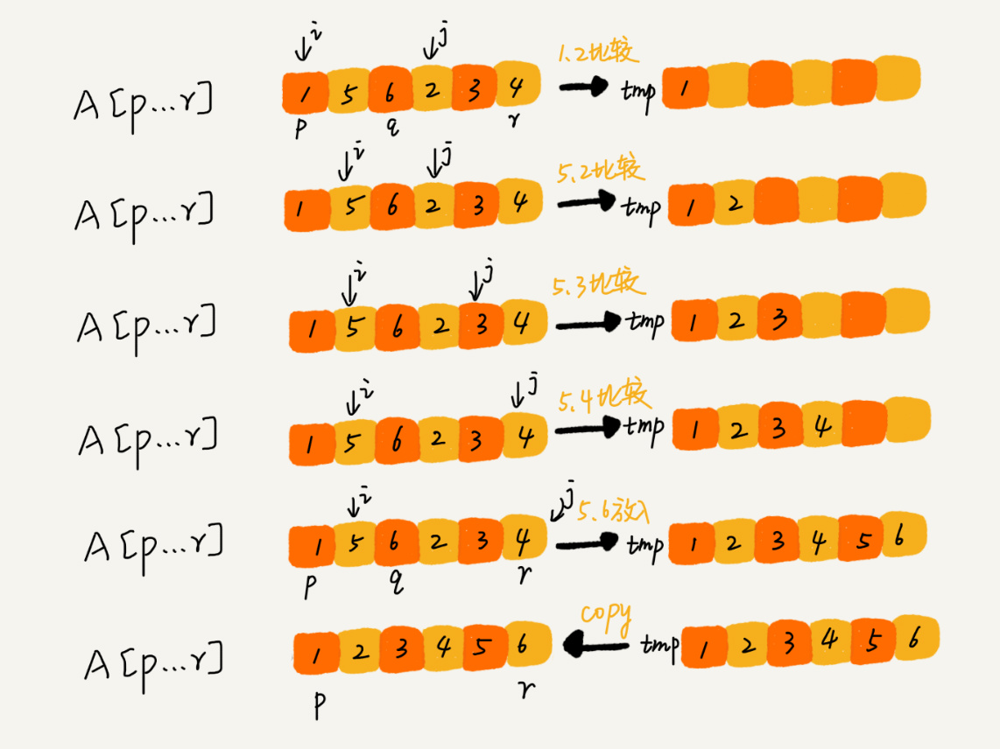

# 常见的排序算法

冒泡排序、插入排序、选择排序、归并排序、快速排序、计数排序、基数排序、桶排序


## 如何分析一个排序算法

### 算法的执行效率
1. 最好情况、最坏情况、平均情况时间复杂度

2. 时间复杂度的系数、常数 、低阶   
时间复杂度反应的是数据规模 n 很大的时候的一个增长趋势，所以它表示的时候会忽略系数、常数、低阶。但是实际的软件开发中，我们排序的可能是 10 个、100 个、
1000 个这样规模很小的数据，所以，在对同一阶时间复杂度的排序算法性能对比的时候，我们就要把系数、常数、低阶也考虑进来。

3. 比较次数和交换（或移动）次数   
比较的排序算法的执行过程，会涉及两种操作，一种是元素比较大小，另一种是元素交换或移动。所以，如果我们在分析排序算法的执行效率的时候，
应该把比较次数和交换（或移动）次数也考虑进去。

### 排序算法的内存消耗
算法的内存消耗可以通过空间复杂度来衡量，排序算法也不例外。不过，针对排序算法的空间复杂度，这里还引入了一个新的概念，**原地排序（Sorted in place）**。
原地排序算法，就是特指空间复杂度是 O(1) 的排序算法。

### 排序算法的稳定性
仅仅用执行效率和内存消耗来衡量排序算法的好坏是不够的。针对排序算法，还有一个重要的度量指标，稳定性。这个概念是说，如果待排序的序列中存在值相等的元素，
经过排序之后，相等元素之间原有的先后顺序不变。

举例：
电商系统中，给订单排序，要求先按金额，相同金额的按照时间排序。如果采用先排金额，相同金额再按时间排序的做法，实现起来会很复杂。
如果采用先按下单时间排序，然后在对订单按金额做稳定性排序，实现起来就很简洁。

## 时间复杂度为O(N^2)的三种排序算法

### 冒泡排序

冒泡排序只会操作相邻的两个数据。每次冒泡操作都会对相邻的两个元素进行比较，看是否满足大小关系要求。如果不满足就让它俩互换。
一次冒泡会让至少一个元素移动到它应该在的位置，重复 n 次，就完成了 n 个数据的排序工作。


优化点： 如果某一次没有数据交换，说明已经顺序已经排好，那么则无需继续进行。

冒泡排序只涉及相邻数据的交换，空间复杂度为O(1)，是原地排序算法。

冒泡排序当相邻两个元素大小相等时，不会交换，所以是稳定的排序算法。

时间复杂度：
最佳：数据已经排好序：O(n)
最差：数据倒序排列O(n^2)
平均：O(n^2)

#### 冒泡平均复杂度的推导

**有序度**：数组中具有有序关系的元素对的个数。
`有序元素对：a[i] <= a[j], 如果i < j。`


对于一个倒序数组，有序度为0. 对于一个倒序数组，有序度为n*(n-1)/2，此时称为**满有序度**。

**逆序度**：与有序度定义相反。
`逆序元素对：a[i] > a[j], 如果i < j。`


冒泡排序包含两个操作原子，比较和交换。每交换一次，有序度就加 1。
不管算法怎么改进，交换次数总是确定的，即为逆序度，也就是n*(n-1)/2–初始有序度。

对n个数据的数组进行冒泡排序：
最坏情况，有序度为0，需要进行n*(n-1)/2 次交换。
最好情况，有序度为n*(n-1)/2，不需要交换。
假设有序度为平均值 n*(n-1)/4，即需要交换n*(n-1)/4次，比较操作肯定要比交换操作多，而复杂度的上限是 O(n2)，所以平均情况下的时间复杂度就是 O(n^2)。


***推导过程不严格，但实用。***


### 插入排序

将数据分为两个区间，已排序区间和未排序区间。初始已排序区间只有一个元素，就是数组的第一个元素。插入算法的核心思想是取未排序区间中的元素，
在已排序区间中找到合适的插入位置将其插入，并保证已排序区间数据一直有序。重复这个过程，直到未排序区间中元素为空，算法结束。


插入排序包含两种操作：插入和移动。对于一个给定的序列，移动操作的次数总是固定的，就等于逆序度。


为什么呢？如图，满有序度是 n*(n-1)/2=15，初始序列的有序度是 5，所以逆序度是 10。插入排序中，数据移动的个数总和也等于 10=3+3+4。
（其实移动n位，可以看做依次交换了n次）

插入排序算法的运行并不需要额外的存储空间，所以空间复杂度是 O(1)，是一个原地排序算法。

在插入排序中，对于值相同的元素，我们可以选择将后面出现的元素，插入到前面出现元素的后面，这样就可以保持原有的前后顺序不变，所以插入排序是稳定的排序算法。

时间复杂度：
最好情况： 数据已经排好序，由于不需要移动数据，最好为O(n)；
最差情况： 数组倒序，每次插入到最前面，复杂度为O(n^2)；
平均复杂度：在一个数组中插入数据品骏复杂度为O(n)，对于插入排序，相当于循环N次插入操作，即复杂度为O(n^2)

### 选择排序

选择排序算法的实现思路有点类似插入排序，也分已排序区间和未排序区间。但是选择排序每次会从未排序区间中找到最小的元素，将其放到已排序区间的末尾。


选择排序空间复杂度为 O(1)，是一种原地排序算法。

选择排序的最好情况时间复杂度、最坏情况和平均情况时间复杂度都为 O(n^2)。

选择排序是一种不稳定的排序算法。选择排序每次都要找剩余未排序元素中的最小值，并和前面的元素交换位置，这样破坏了稳定性。

### 为什么插入排序要优于冒泡排序


```
    // 冒泡排序中数据的交换操作：
    if (a[j] > a[j+1]) { // 交换
       int tmp = a[j];
       a[j] = a[j+1];
       a[j+1] = tmp;
       flag = true;
    }
    
    // 插入排序中数据的移动操作：
    if (a[j] > value) {
      a[j+1] = a[j];  // 数据移动
    } else {
      break;
    }
```

虽然冒泡排序和插入排序的算法复杂度是一样的，但是从代码可知：冒泡排序需要 3 个赋值操作，而插入排序只需要 1 个，
假设执行一个赋值语句的时间粗略地计为单位时间（unit_time），用冒泡排序，需要 K 次交换操作，每次需要 3 个赋值语句，所以交换操作总耗时就是 3*K 单位时间。
而插入排序中数据移动操作只需要 K 个单位时间。


## 时间复杂度为O(nlogn)的两种排序算法

### 归并排序

如果要排序一个数组，我们先把数组从中间分成前后两部分，然后对前后两部分分别排序，再将排好序的两部分合并在一起，这样整个数组就都有序了。




归并排序使用的就是分治思想。分治，顾名思义，就是分而治之，将一个大问题分解成小的子问题来解决。小的子问题解决了，大问题也就解决了。

归并排序分为归和并，两个步骤，归：将数组递归一分为二，并：采取新建一个相同大小的数组的方式，将两个待合并数组逐个遍历，放入临时数组，当其中一个待
遍历数组遍历完成后，将另一个剩余数组全部放入临时数组，最后将临时数组拷贝到原数组。

#### 归并排序的性能分析

归并算法的稳定性取决于最后merge的过程，只要保证先将前边半个数组优先放入temp,即可保证归并排序的稳定性。


时间复杂度：

递推关系式：
T(a) = T(b) + T(c) + K

假设对 n 个元素进行归并排序需要的时间是 T(n)，那分解成两个子数组排序的时间都是 T(n/2)。我们知道，merge() 函数合并两个有序子数组的时间复杂度是 O(n)。
所以，套用前面的公式，归并排序的时间复杂度的计算公式就是：

```
T(1) = C；   n=1时，只需要常量级的执行时间，所以表示为C。
T(n) = 2*T(n/2) + n； n>1


T(n) = 2*T(n/2) + n
     = 2*(2*T(n/4) + n/2) + n = 4*T(n/4) + 2*n
     = 4*(2*T(n/8) + n/4) + 2*n = 8*T(n/8) + 3*n
     = 8*(2*T(n/16) + n/8) + 3*n = 16*T(n/16) + 4*n
     ......
     = 2^k * T(n/2^k) + k * n
     ......
```

当 T(n/2^k)=T(1) 时，也就是 n/2^k=1，得到 k=log2n；
带入上式，得：T(n)=Cn+nlog2n
所以： 时间复杂度为O(nlogn)；

**不管是最好情况、最坏情况，还是平均情况，时间复杂度都是 O(nlogn)。**


空间复杂度：

如果我们继续按照分析递归时间复杂度的方法，通过递推公式来求解，那整个归并过程需要的空间复杂度就是 O(nlogn)。
实际上，递归代码的空间复杂度并不能像时间复杂度那样累加。临时空间在合并完成之后会进行释放，所以使用最大也不会超过n个数据的大小，
所以空间复杂度为O(n)；


### 快速排序

快排利用的也是分治思想。

如果要排序数组中下标从 p 到 r 之间的一组数据，我们选择 p 到 r 之间的任意一个数据作为 pivot（分区点）。我们遍历 p 到 r 之间的数据，
将小于 pivot 的放到左边，将大于 pivot 的放到右边，将 pivot 放到中间。经过这一步骤之后，数组 p 到 r 之间的数据就被分成了三个部分，
前面 p 到 q-1 之间都是小于 pivot 的，中间是 pivot，后面的 q+1 到 r 之间是大于 pivot 的。逐步递归区间，直到区间长度为1.


```
递推公式：
quick_sort(p…r) = quick_sort(p…q-1) + quick_sort(q+1… r)

终止条件：
p >= r

```


快排的重点在于分区的过程。

如果不考虑空间消耗的话，可以申请两个临时数组 X 和 Y，遍历 `A[p…r]`，将小于 pivot 的元素都拷贝到临时数组 X，将大于 pivot 的元素都拷贝到临时数组 Y，
最后再将数组 X 和数组 Y 中数据顺序拷贝到 `A[p…r]`。


但是该种方式会需要很多额外的内存空间，所以快排就不是原地排序算法了。所以这里采取交换的方法实现。
```
partition(A, p, r) {
  pivot := A[r]
  i := p
  for j := p to r-1 do {
    if A[j] < pivot {
      swap A[i] with A[j]
      i := i+1
    }
  }
  swap A[i] with A[r]
  return i
```

我们通过游标 i 把 `A[p…r-1]`分成两部分。`A[p…i-1]`的元素都是小于 pivot 的，我们暂且叫它“已处理区间”，`A[i…r-1]`是“未处理区间”。
我们每次都从未处理的区间 `A[i…r-1]`中取一个元素 `A[j]`，与 pivot 对比，如果小于 pivot，则将其加入到已处理区间的尾部，也就是 `A[i]`的位置。


（类似选择排序）


#### 快排的性能分析

快排是一种原地、不稳定的排序方法。

时间复杂度：
如果每次分区点刚刚好可以将数组分成大小相等的两份，那么和上述归并排序法一样，快排也可以利用如下递归公式来计算：
```
T(1) = C；   n=1时，只需要常量级的执行时间，所以表示为C。
T(n) = 2*T(n/2) + n； n>1
```
所以最佳时间复杂度为O(nlogn)。

但在极端条件下，比如如果数组中的数据原来已经是有序的了，比如 1，3，5，6，8。如果我们每次选择最后一个元素作为 pivot，
那每次分区得到的两个区间都是不均等的。我们需要进行大约 n 次分区操作，才能完成快排的整个过程。每次分区我们平均要扫描大约 n/2 个元素，(第一次扫描n个，最后一次扫描1个，平均n/2)
这种情况下，快排的时间复杂度就从 O(nlogn) 退化成了 O(n^2)。

其他情况可以利用递归树进行求解，结论：T(n) 在大部分情况下的时间复杂度都可以做到 O(nlogn)，只有在极端情况下，才会退化到 O(n2)。

#### 快排与归并的对比


归并排序的处理过程是由下到上的，先处理子问题，然后再合并。而快排正好相反，它的处理过程是由上到下的，先分区，然后再处理子问题。
归并排序虽然是稳定的、时间复杂度为 O(nlogn) 的排序算法，但是它是非原地排序算法。我们前面讲过，归并之所以是非原地排序算法，主要原因是合并函数无法在原地执行。
快速排序通过设计巧妙的原地分区函数，可以实现原地排序，解决了归并排序占用太多内存的问题。


## 如何在O(n) 时间复杂度内求无序数组中的第 K 大元素。比如，4， 2， 5， 12， 3 这样一组数据，第 3 大元素就是 4。

我们选择数组区间 `A[0…n-1]`的最后一个元素 `A[n-1]`作为 pivot，对数组 `A[0…n-1]`原地分区，这样数组就分成了三部分，`A[0…p-1]`、`A[p]`、`A[p+1…n-1]`。
如果 p+1=K，那` A[p]`就是要求解的元素；如果 K>p+1, 说明第 K 大元素出现在 `A[p+1…n-1]`区间，我们再按照上面的思路递归地在 `A[p+1…n-1]`这个区间内查找。同理，如果 K
K<p+1，那我们就在 `A[0…p-1]`区间查找。

为什么复杂度是O(n)呢？

第一次分区查找，我们需要对大小为 n 的数组执行分区操作，需要遍历 n 个元素。第二次分区查找，我们只需要对大小为 n/2 的数组执行分区操作，需要遍历 n/2 个元素。
依次类推，分区遍历元素的个数分别为、n/2、n/4、n/8、n/16.……直到区间缩小为 1。如果我们把每次分区遍历的元素个数加起来，就是：n+n/2+n/4+n/8+…+1。
这是一个等比数列求和，最后的和等于 2n-1。所以，上述解决思路的时间复杂度就为 O(n)。


## 时间复杂度是 O(n) 的排序算法

三种时间复杂度是 O(n) 的排序算法：桶排序、计数排序、基数排序。因为这些排序算法的时间复杂度是线性的，所以我们把这类排序算法叫作线性排序（Linear sort）。
之所以能做到线性的时间复杂度，主要原因是，这三个算法是非基于比较的排序算法，都不涉及元素之间的比较操作。

### 桶排序 （Bucket sort）

核心思想：
将要排序的数据分到几个有序的桶里，每个桶里的数据再单独进行排序。桶内排完序之后，再把每个桶里的数据按照顺序依次取出，组成的序列就是有序的了。

时间复杂度为什么是O(n)？
如果要排序的数据有 n 个，我们把它们均匀地划分到 m 个桶内，每个桶里就有 k=n/m 个元素。每个桶内部使用快速排序，时间复杂度为 O(k * logk)。
m 个桶排序的时间复杂度就是 O(m * k * logk)，因为 k=n/m，所以整个桶排序的时间复杂度就是 O(n*log(n/m))。当桶的个数 m 接近数据个数 n 时，
log(n/m) 就是一个非常小的常量，这个时候桶排序的时间复杂度接近 O(n)。

桶排序苛刻的使用条件：
1. 要排序的数据需要很容易就能划分成 m 个桶，并且，桶与桶之间有着天然的大小顺序。这样每个桶内的数据都排序完之后，桶与桶之间的数据不需要再进行排序。
2. 数据在各个桶之间的分布是比较均匀的。如果数据经过桶的划分之后，有些桶里的数据非常多，有些非常少，很不平均，那桶内数据排序的时间复杂度就不是常量级了。
在极端情况下，如果数据都被划分到一个桶里，那就退化为 O(nlogn) 的排序算法了。
3. **桶排序比较适合用在外部排序中**。所谓的外部排序就是数据存储在外部磁盘中，数据量比较大，内存有限，无法将数据全部加载到内存中。


### 计数排序（Counting sort）

计数排序其实是桶排序的一种特殊情况。当要排序的 n 个数据，所处的范围并不大的时候，比如最大值是 k，我们就可以把数据划分成 k 个桶。
每个桶内的数据值都是相同的，省掉了桶内排序的时间。

例如：
假设只有 8 个考生，分数在 0 到 5 分之间。这 8 个考生的成绩我们放在一个数组 A[8]中，它们分别是：2，5，3，0，2，3，0，3。
将考生的成绩划分到从 0 到 5 这六个桶里，我们只要一次遍历每个桶，将桶内考生输出到一个数组中，就实现了排序。

时间复杂度： 因为只涉及比遍历操作，故时间复杂度为O(n)；

#### 如何快速求出每个分数在数组中的存储位置呢？

以数组数组 A[8] 为例：[2，5，3，0，2，3，0，3]

进行计数排序, 得C[6]:[2,0,2,3,0,1],

对 C[6]数组顺序求和，C[6]存储的数据就变成了下面这样子。C[k]里存储小于等于分数 k 的考生个数。
[2,2,4,7,7,8]

我们从后到前依次扫描数组 A。比如，当扫描到 3 时，我们可以从数组 C 中取出下标为 3 的值 7，也就是说，到目前为止，包括自己在内，
分数小于等于 3 的考生有 7 个，也就是说 3 是数组 R 中的第 7 个元素（也就是数组 R 中下标为 6 的位置）。当 3 放入到数组 R 中后，
小于等于 3 的元素就只剩下了 6 个了，所以相应的 C[3]要减 1，变成 6。

以此类推，当我们扫描到第 2 个分数为 3 的考生的时候，就会把它放入数组 R 中的第 6 个元素的位置（也就是下标为 5 的位置）。
当我们扫描完整个数组 A 后，数组 R 内的数据就是按照分数从小到大有序排列的了。


#### 计数排序的使用场景
计数排序只能用在数据范围不大的场景中，如果数据范围 k 比要排序的数据 n 大很多，就不适合用计数排序了。
而且，计数排序只能给非负整数排序，如果要排序的数据是其他类型的，要将其在不改变相对大小的情况下，转化为非负整数。


### 基数排序 (Radix sort)

假如需要对若干手机号码进行排序，先按照最后一位来排序手机号码，然后，再按照倒数第二位重新排序，以此类推，最后按照第一位重新排序。
经过 11 次排序之后，手机号码就都有序了。


根据每一位来排序，利用桶排或者计数排序，可以做到O(n)，k位的总复杂度是O(k*n)，近似接近于O(n)


基数排序对要排序的数据是有要求的，需要可以分割出独立的“位”来比较，而且位之间有递进的关系，如果 a 数据的高位比 b 数据大，那剩下的低位就不用比较了。
除此之外，每一位的数据范围不能太大，要可以用线性排序算法来排序，否则，基数排序的时间复杂度就无法做到 O(n) 了。
