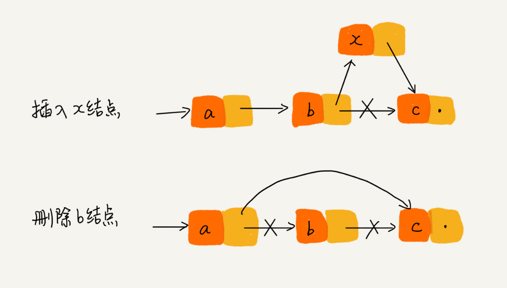

# 链表

## 常见的缓存淘汰策略
1. 先进先出策略 FIFO（First In，First Out）
2. 最少使用策略 LFU （Least Frequently Used）
3. 最近最少使用策略 LRU （Least Recently Used）

## 常见的链表类型

### 单链表

结点：数据+后继指针

头结点：记录链表基地址
尾结点：指向空地址Null

### 循环链表

循环链表与单链表的区别在于：尾结点的指针指向头结点。
与单链表相比，循环链表的有点事从链尾到链头比较方便，当处理的数据具有环形结构是，特别适合。比如"约瑟夫问题"

### 双链表

结点：前驱指针 + 数据 + 后继指针
从结构上来看，双向链表可以支持 O(1) 时间复杂度的情况下找到前驱结点，正是这样的特点，也使双向链表在某些情况下的插入、删除等操作都要比单链表简单、高效。

原因在于，常见的对于一个结点的操作，无外乎一下两种情况：
1. 删除给定值的结点
2. 删除给定指针的结点

第一种情况下，为了找到该结点，需要从头对链表进行一次时间复杂度为O(n)的遍历；第二种情况，如果是删除操作或者插入到给定结点之前，由于需要找到上一个结点，但是为了找到上一个结点，
同样要进行一次时间复杂度为O(n)的遍历。这时，就能体现出双向链表的优势了。

双向链表的数据结构体现了**空间换时间**的设计思想。

### 双向循环链表

循环链表 + 双向链表

### 链表VS数组

| 时间复杂度 |链表 |数组  |
|---|-----|-----|
|插入删除| O(1) | O(n)  |
|随机访问|  O(n) | O(1)  |

数组简单易用，由于使用连续的内存空间，可以借助CPU的缓存机制，预读数组中的数据，所以访问效率更高。而链表由于不是连续存储，对CPU缓存不够友好，没有办法有效预读。

数组的缺点在于大小固定，占用整块连续内存区间，如果声明数组过大，可能会导致没有足够的内存分配给他，导致 "内存不足 out of memory"，而声明的过小，扩容需要
先申请空间，然后将原数组拷贝过去，非常耗时。而链表天然支持动态扩容。

