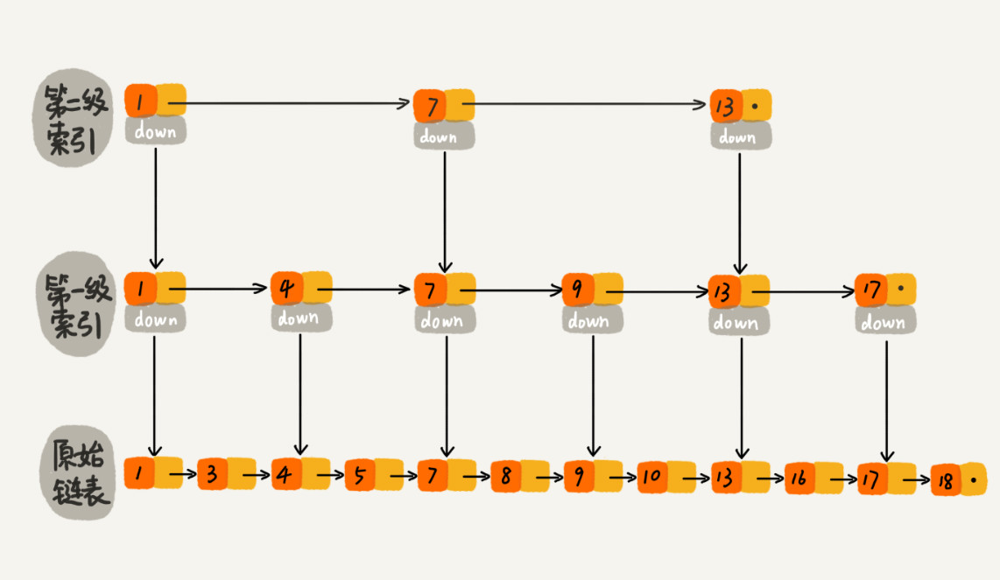

# 跳表

这种链表加多级索引的结构，就是跳表

## 跳表的时间复杂度
每两个结点会抽出一个结点作为上一级索引的结点，那第一级索引的结点个数大约就是 n/2，第二级索引的结点个数大约就是 n/4，第三级索引的结点个数大约就是 n/8，
依次类推，也就是说，第 k 级索引的结点个数是第 k-1 级索引的结点个数的 1/2，那第 k级索引结点的个数就是 n/(2k)。

假设索引有 h 级，最高级的索引有 2 个结点。通过上面的公式，我们可以得到 n/(2h)=2，从而求得 h=log2n-1。
如果包含原始链表这一层，整个跳表的高度就是 log2n。我们在跳表中查询某个数据的时候，如果每一层都要遍历 m 个结点，那在跳表中查询一个数据的时间复杂度就是 O(m*logn)。

## 跳表的空间复杂度

假设原始链表大小为 n，那第一级索引大约有 n/2 个结点，第二级索引大约有 n/4 个结点，以此类推，每上升一级就减少一半，直到剩下 2 个结点。
如果我们把每层索引的结点数写出来，就是一个等比数列。

这几级索引的结点总和就是 n/2+n/4+n/8…+8+4+2=n-2。所以，跳表的空间复杂度是 O(n)。

## 跳表的动态插入和删除

与查找类似，链表单纯的插入和删除操作复杂度很低，需要注意的是，删除结点时，如果该节点在索引中也存在，需要一同删除。
插入、删除操作的时间复杂度 O(logn)；

## 跳表的动态更新

当我们不停地往跳表中插入数据时，如果我们不更新索引，就有可能出现某 2 个索引结点之间数据非常多的情况。极端情况下，跳表还会退化成单链表。

我们通过一个随机函数，来决定将这个结点插入到哪几级索引中，比如随机函数生成了值 K，那我们就将这个结点添加到第一级到第 K 级这 K 级索引中。

